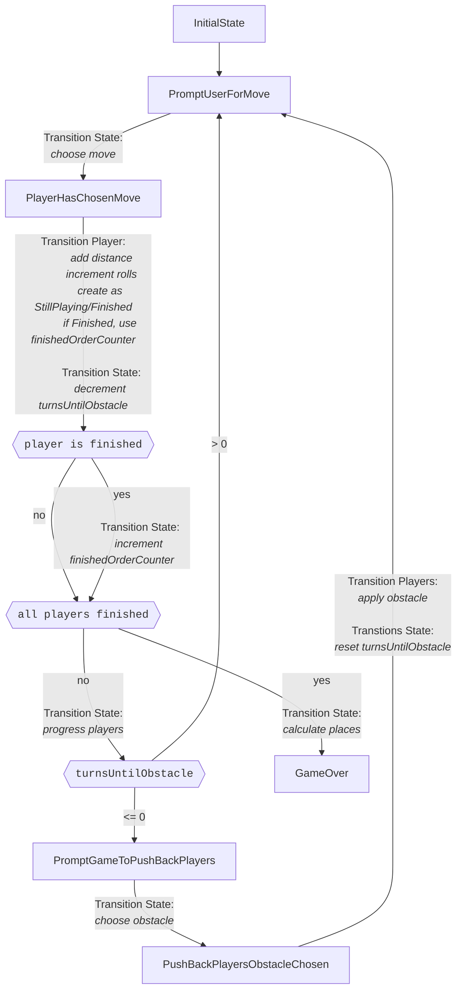

# Dice Race Game

A simple dice race game to demonstrate a board game framework.

```mermaid
flowchart TB
    InitialState
    CheckForPushBackGame{{<tt>turnsUntilObstacle</tt>}}
    PromptUserForMove
    PlayerHasChosenMove
    CheckForPlayerFinished{{<tt>player is finished</tt>}}
    CheckForAllPlayersFinished{{<tt>all players finished</tt>}}
    PromptGameToPushBackPlayers
    PushBackPlayersObstacleChosen
    GameOver

    InitialState --> PromptUserForMove

    CheckForPushBackGame -->|<= 0| PromptGameToPushBackPlayers
    CheckForPushBackGame -->|> 0| PromptUserForMove

    PromptUserForMove -->|
            Transition State:
            <em>choose move</em>
        | PlayerHasChosenMove
    PlayerHasChosenMove -->|
            Transition Player:
            <em>add distance</em>
            <em>increment rolls</em>
            <em>create as StillPlaying/Finished</em>
            <em>if Finished, use finishedOrderCounter</em>

            Transition State:
            <em>decrement turnsUntilObstacle</em>
        | CheckForPlayerFinished

    CheckForPlayerFinished -->|
            no
        | CheckForAllPlayersFinished
    CheckForPlayerFinished -->|
            yes

            Transition State:
            <em>increment finishedOrderCounter</em>
        | CheckForAllPlayersFinished

    PromptGameToPushBackPlayers -->|
            Transition State:
            <em>choose obstacle</em>
        | PushBackPlayersObstacleChosen
    PushBackPlayersObstacleChosen -->|
            Transition Players:
            <em>apply obstacle</em>

            Transtions State:
            <em>reset turnsUntilObstacle</em>
        | PromptUserForMove

    CheckForAllPlayersFinished -->|
            no

            Transition State:
            <em>progress players</em>
        | CheckForPushBackGame

    CheckForAllPlayersFinished -->|
            yes
            
            Transition State:
            <em>calculate places</em>
        | GameOver
```
